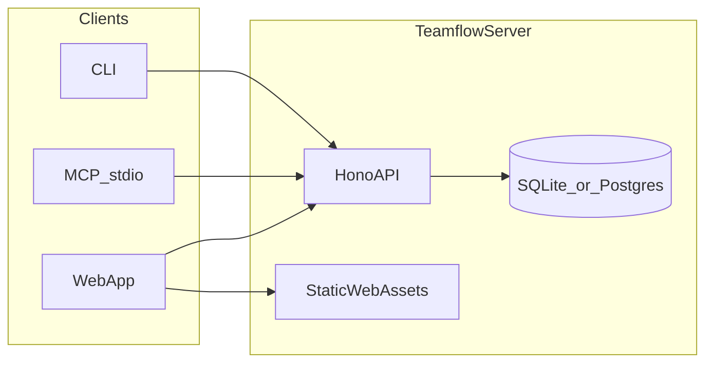
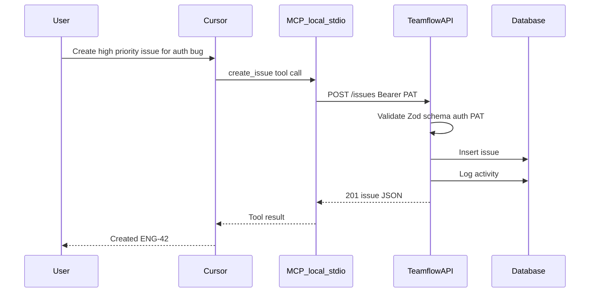
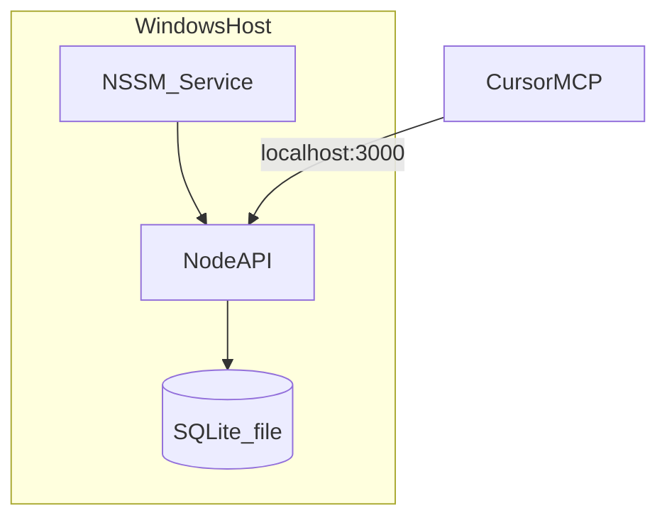
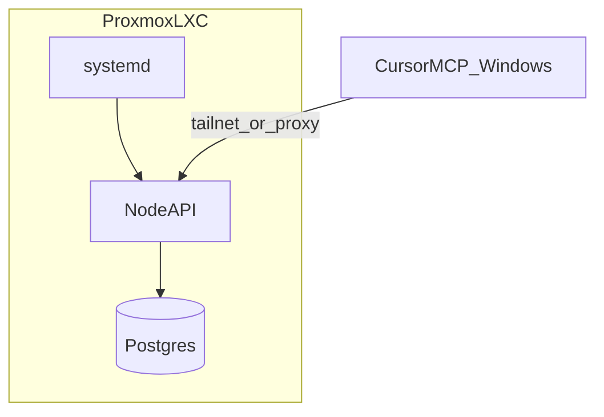

# Architecture

High-level system design for Teamflow. See [AI_CONTEXT.md](AI_CONTEXT.md) for conventions and locked decisions.

## System diagram

## Request flow — create issue via MCP

## Package boundaries

| Package | Responsibility | Depends on |
|---------|----------------|------------|
| `packages/core` | Types, Zod schemas, constants | — |
| `packages/db` | Drizzle schema, migrations, seed | core |
| `packages/api-client` | Typed fetch wrapper | core |
| `apps/server` | HTTP routes, auth, static files | core, db, api-client |
| `apps/web` | React UI | core, api-client |
| `apps/mcp` | MCP tool definitions | core, api-client |
| `apps/cli` | Command-line interface | core, api-client |

**Rule:** `apps/mcp` and `apps/cli` never import `packages/db`. All data access goes through the API.

## Deployment topologies

### Setup A — Windows

### Setup B — Proxmox LXC

## Auth layers

1. **Session auth** — web UI only; cookie-based
2. **PAT auth** — MCP, CLI, future webhooks; `Bearer` header
3. **Team membership** — authorization after authentication

## Production static assets

In production, `apps/server` serves the built `apps/web/dist` files. In development, Vite dev server proxies API calls (or runs on separate port).
